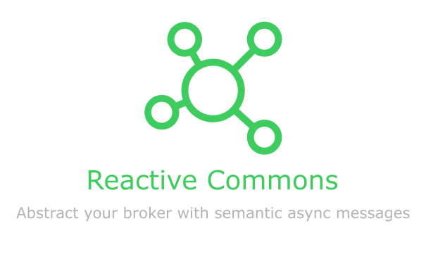

# Overview

## Reactive Commons

The purpose of reactive-commons is to provide a set of abstractions and implementations over different patterns and practices that make the foundation of a reactive microservices architecture.

Even though the main purpose is to provide such abstractions in a mostly generic way such abstractions would be of little use without a concrete implementation so we provide some implementations in a best effors maner that aim to be easy to change, personalize and extend.

The first approach to this work was to release a very simple abstractions and a corresponding implementation over asyncronous message driven communication between microservices build on top of project-reactor and spring boot.

## Project Reactor

[Reactor](https://projectreactor.io) is a highly optimized reactive library for
building efficient, non-blocking applications on the JVM based on the
[Reactive Streams Specification](https://github.com/reactive-streams/reactive-streams-jvm).
Reactor based applications can sustain very high throughput message rates
and operate with a very low memory footprint,
making it suitable for building efficient event-driven applications using
the microservices architecture.

Reactor implements two publishers
[Flux\<T>](https://projectreactor.io/docs/core/release/api/reactor/core/publisher/Flux.html) and
[Mono\<T>](https://projectreactor.io/docs/core/release/api/reactor/core/publisher/Mono.html),
both of which support non-blocking back-pressure.
This enables exchange of data between threads with well-defined memory usage,
avoiding unnecessary intermediate buffering or blocking.

## Reactive API for Event Mechanism

Reactive Commons is a reactive API for asynchronous message driven communication based on Reactor.
Reactive Commons API enables messages to be published over a event bus like RabbitMQ or SNS/SQS and consumed using functional APIs with non-blocking back-pressure and low overheads.
It enables applications using Reactor to use RabbitMQ or SNS/SQS as a message bus, integrating it with other systems to provide an end-to-end reactive system.

When we talk about asynchronous message driven communication, we can use several sematic ways to use the term "message". So, we can talk about Events, Commands and Queries.

## Cloud Events

[CloudEvents](https://cloudevents.io/) is a specification for describing event data in a common way. CloudEvents seeks to dramatically simplify event declaration and delivery across services, platforms, and beyond!

## Async API

[Async API](https://www.asyncapi.com/) Open-Source tools to easily build and maintain your event-driven architecture. All powered by the AsyncAPI specification, the industry standard for defining asynchronous APIs.

## Reactive Commons Abstraction

#### Events - Pub/Sub

Events represent a fact inside the domain, it is the representation of a decision or a state change that a system want to notify to its subscribers. Events represents facts that nobody can change, so events are not intentions or requests of anything, An example may be and UserRegistered or a NotificationSent.

Events are the most important topic in a Publish-Subscribe system, because this element let's notify a many stakeholders in a specific event. An other benefit is the system is decouple, because you can add more subscriber to the system without modify some component.

We support a Notification Event pattern in which each instance of an app can receive an event, it can be used to refresh or invalidate some data in all replicas.

#### Commands

Commands represent a intention for doing something, that intention must to be done by the domain context with that responsibility. An example of a command may be:  "registerUser" or "sendNotification".

#### Request / Reply

Queries represent a intention for getting information about something, that query must to be processed by the domain context with that responsibility and that context must respond with the information requested throught request/reply pattern. An example of a query may be:  "UserInfo".

## Versioning

Reactive Commons uses [Semantic Versioning Specification](https://semver.org)

Reactive Commons uses a MAJOR.MINOR.PATCH scheme, whereby an increment in:

MAJOR version when you make incompatible API changes,

MINOR version when you add functionality in a backwards compatible manner, and

PATCH version when you make backwards compatible bug fixes. Additional labels for pre-release and build metadata are available as extensions to the MAJOR.MINOR.PATCH format. == New & Noteworthy

